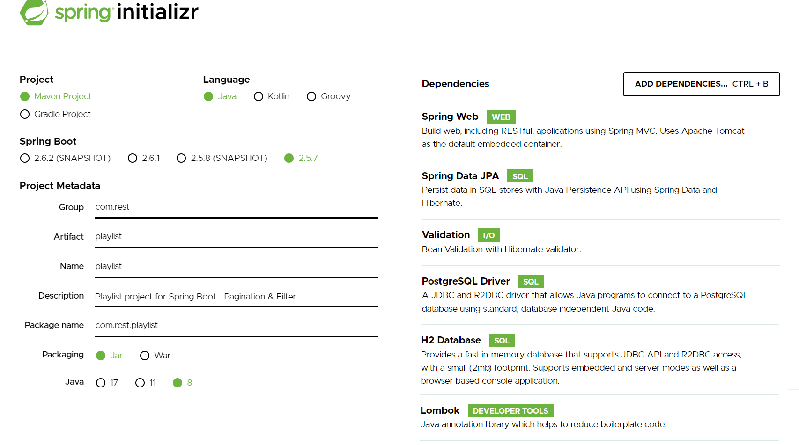
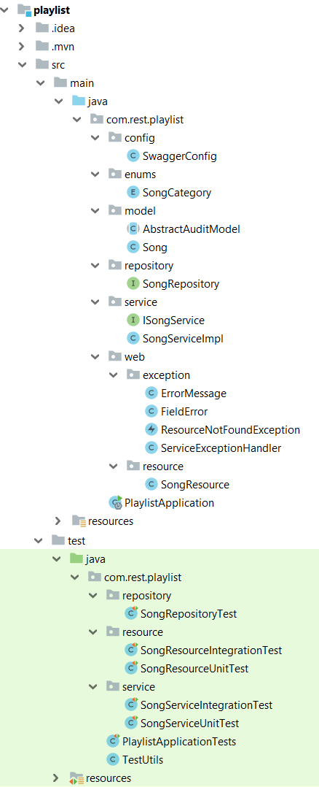
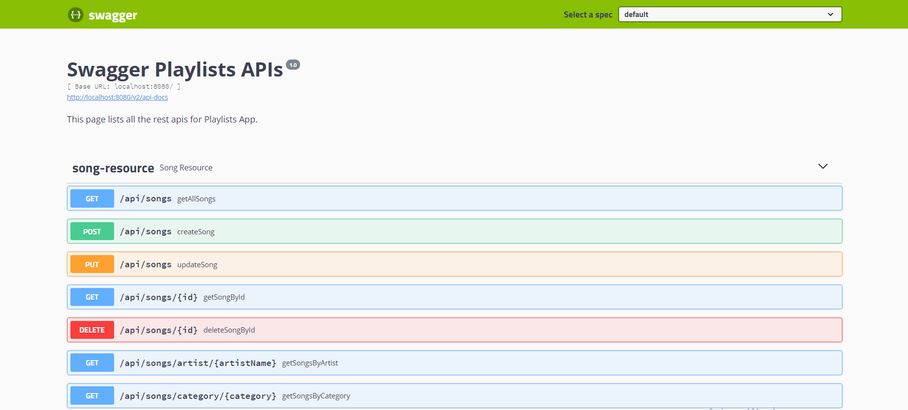
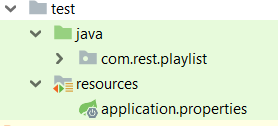

# Spring Boot Rest Api Data JPA avec Spring Pagination & Filter - Playlists
Dans ce tutoriel, nous allons écrire un service CRUD REST Spring Boot simple basé sur un statut HTTP bien utilisé et entièrement couvert par des tests.

Nous allons créer une API Spring Boot Rest CRUD pour une application de playlist dans les termes suivants :

Chaque Song a un identifiant, un titre, une description, une catégorie, une durée et un nom de l’artiste.

Apis aide à créer, récupérer, mettre à jour, supprimer des Song.

Apis prend également en charge les méthodes de recherche personnalisées telles que la recherche par catégorie ou par nom de l’artiste => filtrer des listes.

Apis utilise la pagination, le tri et le filtre.

##### Spring Boot
Spring Boot est un projet Spring qui facilite le processus de configuration et de publication des applications.

En suivant des étapes simples, vous pourrez exécuter votre premier projet.

##### API REST (Representational State Transfer Application Program Interface)
Il se base sur le protocole **HTTP** pour transférer des informations. 
Un client lance une requête HTTP, et le serveur renvoie une réponse à travers plusieurs méthodes dont les plus utilisées sont : **POST**, **GET**, **PUT** et **DELETE**.

##### Outils utilisés : 
* Java 8
* IDE Intellij IDEA
* Spring Boot 2.5.7 (avec Spring Web MVC et Spring Data JPA)
* PostgreSQL
* H2 Database
* Lombok 1.18.22
* Maven 4.0.0


## Initialisation du projet
Pour amorcer une application Spring Boot , nous pouvons démarrer le projet à partir de zéro avec notre IDE préféré, ou simplement utiliser un autre moyen qui facilite la vie : [SpringInitializr](https://start.spring.io/)

Initialement, nous avons choisi les dépendances suivantes : Spring web, Spring Data JPA, Validation,H2 Database, Lombok et PostgreSQL Driver.



## Structure du projet
L'image ci-dessous montre la structure finale du projet



* **Pom.xml**

Contient des dépendances pour Spring Boot. Dans notre cas, nous sommes besoin de ces dépendances.

```xml
<dependencies>
		<dependency>
			<groupId>org.springframework.boot</groupId>
			<artifactId>spring-boot-starter-data-jpa</artifactId>
		</dependency>
		<dependency>
			<groupId>org.springframework.boot</groupId>
			<artifactId>spring-boot-starter-validation</artifactId>
		</dependency>
		<dependency>
			<groupId>org.springframework.boot</groupId>
			<artifactId>spring-boot-starter-web</artifactId>
		</dependency>

		<dependency>
			<groupId>com.h2database</groupId>
			<artifactId>h2</artifactId>
			<scope>runtime</scope>
		</dependency>
		<dependency>
			<groupId>org.postgresql</groupId>
			<artifactId>postgresql</artifactId>
			<scope>runtime</scope>
		</dependency>
		<dependency>
			<groupId>org.projectlombok</groupId>
			<artifactId>lombok</artifactId>
			<optional>true</optional>
		</dependency>
		<dependency>
			<groupId>org.springframework.boot</groupId>
			<artifactId>spring-boot-starter-test</artifactId>
			<scope>test</scope>
		</dependency>
        <dependency>
            <groupId>org.apache.commons</groupId>
            <artifactId>commons-lang3</artifactId>
            <version>3.9</version>
        </dependency>
		<dependency>
			<groupId>junit</groupId>
			<artifactId>junit</artifactId>
			<version>4.13.1</version>
			<scope>test</scope>
		</dependency>
        <dependency>
            <groupId>io.springfox</groupId>
            <artifactId>springfox-core</artifactId>
            <version>2.9.2</version>
        </dependency>
		<dependency>
            <groupId>io.springfox</groupId>
            <artifactId>springfox-swagger-ui</artifactId>
            <version>2.9.2</version>
        </dependency>
        <dependency>
            <groupId>io.springfox</groupId>
            <artifactId>springfox-swagger2</artifactId>
            <version>2.9.2</version>
        </dependency>
		<dependency>
			<groupId>org.hibernate</groupId>
			<artifactId>hibernate-envers</artifactId>
			<version>5.6.1.Final</version>
		</dependency>
	</dependencies>
```

* **Main Class**

C’est la classe principale de l’application et appelée aussi une classe de démarrage.

L ’adresse par défaut d’exécution : http://localhost:8080 

```java 
@SpringBootApplication
public class PlaylistApplication {

	public static void main(String[] args) {
		SpringApplication.run(PlaylistApplication.class, args);
	}

}
```

## I. Configuration PostgreSQL
* **application.properties**

Les propriétés **spring.datasource.username** et **spring.datasource.password** sont les mêmes que celles de votre installation de base de données.

Spring Boot utilise Hibernate pour l'implémentation JPA, nous configurons PostgreSQLDialect pour PostgreSQL 🡺 Ce dialecte nous permet de générer de meilleures requêtes SQL pour cette base de données.

**spring.jpa.hibernate.ddl-auto= update** est utilisé pour créer automatiquement les tables en fonction des classes d’entités dans l’application. Toute modification du modèle déclenche également une mise à jour de la table. 

Pour la production, cette propriété doit être **validate**, cette valeur valide le schéma en correspondance avec le mapping hibernate.


```yaml
spring.datasource.url=jdbc:postgresql://localhost:5432/playlist_db
spring.datasource.username=playlistadmin
spring.datasource.password=admin

spring.jpa.properties.hibernate.dialect = org.hibernate.dialect.PostgreSQLDialect

spring.jpa.hibernate.ddl-auto=update
```
## II. Modèle
* **AbstractAuditModel**
Les deux modèles de l’application Playlist et Song auront des champs communs liés à l'audit tels que createdAt et updatedAt.

Il est préférable de faire abstraction de ces champs communs dans une classe de base distincte appelée AbstractAuditModel. Cette classe sera étendue par d'autres entités.

**@EntityListeners(AuditingEntityListener.class)** : les valeurs de createdAt et updatedAt seront automatiquement renseignées lorsque les entités seront conservées.

**@MappedSuperclass.java**

En utilisant la stratégie MappedSuperclass, l'héritage n'est évident que dans la classe mais pas dans le modèle d'entité. Il faut noter que cette classe n'a plus d’annotation @Entity, car elle ne sera pas conservée seule dans la base de données.

```java
@MappedSuperclass
@Audited
@EntityListeners(AuditingEntityListener.class)
public abstract class AbstractAuditModel implements Serializable {

    @CreatedDate
    @JsonIgnore
    @Column(name = "created_at", nullable = false, updatable = false)
    private Instant createAt = Instant.now();

    @LastModifiedDate
    @JsonIgnore
    @Column(name = "updated_at")
    private Instant updatedAt;

    public Instant getCreateAt() {
        return createAt;
    }

    public void setCreateAt(Instant createAt) {
        this.createAt = createAt;
    }

    public Instant getUpdatedAt() {
        return updatedAt;
    }

    public void setUpdatedAt(Instant updatedAt) {
        this.updatedAt = updatedAt;
    }
}
```
**@EnableJpaAuditing** : Pour activer l'audit JPA (dans la classe de repository)

* **Song.java**

L’entité « Song » est mappé à une table nommée « songs » dans la base de données

- l'annotation **@Entity** indique que la classe est une classe Java persistante.

– l'annotation **@Table** fournit la table qui mappe cette entité.

– l'annotation **@Id** est pour la clé primaire.

– l'annotation **@GeneratedValue** est utilisée pour définir la stratégie de génération de la clé primaire. **GenerationType.SEQUENCE** signifie la génération de la clé primaire se fera par une séquence définie dans le SGBD, auquel on ajoute l’attribut generator.

– l'annotation **@Column** est utilisée pour définir la colonne dans la base de données qui mappe le champ annoté.
  
Ici, nous allons utiliser **Lombok** : est une bibliothèque Java qui se connecte automatiquement à un éditeur afin de générer automatiquement les méthodes getter ou equals à l'aide des annotations.
  
* **@Getter / @Setter** :  pour générer automatiquement le getter/setter par défaut.

```java
@Entity
@Getter
@Setter
@Table(name = "songs")
public class Song extends AbstractAuditModel{

    @Id
    @GeneratedValue(strategy = GenerationType.SEQUENCE, generator = "SONG_SEQ")
    @SequenceGenerator(name = "SONG_SEQ", sequenceName = "song_seq", allocationSize = 1)
    private Long id;

    @Column(name = "title")
    @NotBlank(message = "titre ne doit pas être null ou vide")
    @Size(min = 3, max = 50, message = "titre doit être compris entre 3 et 50 caractères")
    private String title;

    @Column(name = "description")
    @NotBlank(message = "description ne doit pas être nulle ou vide")
    @Size(min = 3, max = 50, message = "description doit être compris entre 3 et 50 caractères")
    private String description;

    @Column(name = "duration")
    @NotBlank(message = "duration ne doit pas être nulle ou vide")
    private String duration;

    @Column(name = "artist_name")
    @NotBlank(message = "artistname ne doit pas être null ou vide")
    private String artistName;

    @Column(name = "category")
    @Enumerated(EnumType.STRING)
    @NotNull(message = "categorie<JAZZ, POP, CLASSICAL> ne doit pas être nulle")
    private SongCategory category;
}
```
### III. enums
La classe « **SongCategory** » contient les différentes valeurs possibles d’une catégorie.

```java 
public enum SongCategory {
    JAZZ,
    CLASSICAL,
    POP
}
```
## IV. Reposirory
Spring framework nous fournit des repositories afin d’encapsuler des détails de la couche de persistance et de fournir une interface CRUD pour une seule entité ⇒ la possibilité de générer toutes sortes d'opérations vers la base de données.

**Spring Data JPA** est le module qui nous permet d’interagir avec une base de données relationnelles en représentant les objets du domaine métier sous la forme d’entités JPA.

L’annotation **@Repository** est une spécialisation de l’annotation **@Component** ⇒ Pour indiquer que la classe définit un référentiel de données

* **SongRepository.java**

Cette interface est utilisée pour accéder aux chansons de la base de données et qui s'étend de JpaRepository.

Avec **JpaRepository**, nous pouvons :

 * Bénéficier automatiquement des méthodes héritées tels que : **findAll(), findById()** …
 * Utiliser les "query methods" qui utilise une convention de nom pour générer automatiquement le code sous-jacent et exécuter la requête tels que :
   
    – **findSongsByCategory()**: renvoie toutes les chansons ayant une valeur de category en paramètre (JAZZ, POP, CLASSICAL).
   
    – **findSongsByArtistName()**: renvoie toutes les chansons qui ont le nom de l’artiste en paramètre.
 * Spring Data JPA fournit un certain contrôle sur la façon d’extraire des enregistrements de la base de données est assuré par l’ajout des fonctionnalités suivantes :
 
 **Filtrage** : utile pour affiner les résultats de la requête par des paramètres spécifiques.
 
 **Tri** : permet essentiellement de trier les résultats par ordre croissant ou décroissant, selon un ou plusieurs paramètres choisis.
 
 **Pagination** : utilise **size** pour réduire le nombre de résultats affichés à un nombre spécifique et **page** pour spécifier la page du résultat à afficher et ne doit pas être négatif.
 
 Dans le code ci-dessous, nous utilisons le paramètre pageable.
```java
@Repository
@EnableJpaAuditing
public interface SongRepository extends JpaRepository<Song, Long> {
    Page<Song> findAll(Pageable pageable);
    Page<Song> findSongsByCategory(SongCategory category, Pageable pageable);
    Page<Song> findSongsByArtistName(String artistName, Pageable pageable);
}
```
## V. Service
* **ISongService**

```java
public interface ISongService {

    Page<Song> getAllSongs(int page,int size);

    Page<Song> getSongsByCategory(String category,int page,int size);

    Page<Song> getSongsByArtistName(String artistName,int page,int size);

    Song getSongById(Long id);

    Song createSong(Song song);

    Song updateSong(Song song);

    void deleteSongById(Long id);
}
```
* **SongServiceImpl**

L'annotation **@Transactional** peut être utilisée pour indiquer au conteneur les méthodes qui doivent s'exécuter dans un contexte transactionnel.

L’annotation **@Transactional(readOnly = true)** permet d’indiquer si la transaction est en lecture seule (false par défaut) ⇒ Pour les interactions avec les bases de données, les transactions en lecture seule signifient que l’on n’effectue que des requêtes pour lire des données.

La création des objets Pageable à l'aide de la classe **PageRequest** qui implémente l'interface **Pageable** :

***Pageable paging = PageRequest.of(page, size, Sort.by(new Sort.Order(Sort.Direction.DESC, field)));***

- Les méthodes suivantes : **getAllSongs**, **getSongsByCategory** et **getSongsByArtist** renvoient un objet de type Page:
    - **getContent()** pour récupérer la liste des éléments de la page.
    - **getNumber()** pour la page actuelle.
    - **getTotalElements()** pour le total des éléments stockés dans la base de données.
    - **getTotalPages()** pour le nombre total de pages.

```java
@Service
@Transactional
public class SongServiceImpl implements ISongService {
    private static final Logger log = LoggerFactory.getLogger(SongServiceImpl.class);

    private final SongRepository songRepository;

    private Pageable paging = PageRequest.of(0, 3, Sort.by(new Sort.Order(Sort.Direction.DESC, "id")));

    public SongServiceImpl(SongRepository songRepository) {
        this.songRepository = songRepository;
    }

    @Override
    @Transactional(readOnly = true)
    public Page<Song> getAllSongs(int page,int size) {
        return songRepository.findAll(paging);
    }

    @Override
    @Transactional(readOnly = true)
    public Page<Song> getSongsByCategory(String category,int page,int size) {

        SongCategory searchedCategory = EnumUtils.getEnumIgnoreCase(SongCategory.class, category);
        if (searchedCategory == null) {
            throw new ResourceNotFoundException("Not found Category with value = " + category);
        }

        return songRepository.findSongsByCategory(searchedCategory, paging);
    }

    @Override
    @Transactional(readOnly = true)
    public Page<Song> getSongsByArtistName(String artistName,int page,int size) {
        return songRepository.findSongsByArtistName(artistName, paging);
    }

    @Override
    @Transactional(readOnly = true)
    public Song getSongById(Long id) {

        return songRepository.findById(id)
                .orElseThrow(() -> new ResourceNotFoundException("Not found song with id = " + id));
    }

    @Override
    public Song createSong(Song song) {
        return songRepository.save(song);
    }

    @Override
    public Song updateSong(Song song) {

        Song searchedSong = songRepository.findById(song.getId())
                .orElseThrow(() -> new ResourceNotFoundException("Not found song with id = " + song.getId()));

        searchedSong.setTitle(song.getTitle());
        searchedSong.setDescription(song.getDescription());
        searchedSong.setArtistName(song.getArtistName());
        searchedSong.setCategory(song.getCategory());
        searchedSong.setDuration(song.getDuration());

        return songRepository.saveAndFlush(song);
    }

    @Override
    public void deleteSongById(Long id) {
        songRepository.findById(id)
                .orElseThrow(() -> new ResourceNotFoundException("Not found song with id = " + id));

        songRepository.deleteById(id);
    }
}
```

## VI. Resource
* **SongResource**

Ce contrôleur expose des end-point pour faire les CRUD (créer, récupérer, mettre à jour, supprimer et trouver) des chansons.

##### Points de terminaison d’API

- Les codes de réponse HTTP: 

    * **200 Success** : La demande a réussi
    * **201 Created** : La demande a été satisfaite et a entraîné la création d'une nouvelle ressource
    * **204 No Content** : La demande a répondu à la demande mais n'a pas besoin de retourner un corps d'entité
    * **400 Bad Request** : La requête n'a pas pu être comprise par le serveur en raison d'une syntaxe mal formée
    * **404 Not Found** : Le serveur n'a rien trouvé correspondant à l'URI de la requête
    * **409 Conflict** : La demande n'a pas pu être traitée en raison d'un conflit avec l'état actuel de la ressource

| Méthode HTTP | URI | Description | Codes d'états http |
| ------------- | ------------- | ------------- | ------------- |
| POST  | /api/songs  | Créer une chanson  | 201  |
| PUT  | /api/songs/{id}  | Modifier une chanson  | 200, 404  |
| GET  | /api/songs/{id}  | Récupérer une chanson | 200, 404  |
| GET  | /api/songs?page=0&size=3  | Récupérer les trois premières chansons de la première page  | 200  |
| GET  | /api/songs/category/{category}?page=0&size=3  | Récupérer les trois premières chansons par catégorie de la première page | 200, 404  |
| GET  | /api/songs/artist/{artistName}?page=0&size=3  | Récupérer les trois premières chansons par nom d'artiste de la première page | 200 |
| DELETE  | /api/songs/{id}  | Supprimer une chanson | 204, 404  |

– l'annotation **@RestController** est utilisée pour définir un contrôleur.

⇒ **@RestController** remplace principalement :

**@Controller** : pour dire que c'est un controlleur, pour que spring le charge dans son context, et pour le rendre singleton.

**@ResponseBody** : pour indiquer que la valeur de retour des méthodes doit être liée au corps de la réponse Web.

**@RequestMapping("/api/songs")** déclare que toutes les URL d'Apis dans le contrôleur commenceront par /api/songs.

– Nous avons injecté la classe **ISongService** par constructeur.

```java
@RestController
@RequestMapping("/api/songs")
public class SongResource {

    final private com.rest.playlist.service.ISongService ISongService;
    private static final Logger log = LoggerFactory.getLogger(SongServiceImpl.class);

    public SongResource(com.rest.playlist.service.ISongService ISongService) {
        this.ISongService = ISongService;
    }

    @GetMapping
    public ResponseEntity<Map<String, Object>> getAllSongs(
            @RequestParam(defaultValue = "0") int page,
            @RequestParam(defaultValue = "3") int size) {

        Map<String, Object> response = setResponsePage(ISongService.getAllSongs(page, size));
        return new ResponseEntity<>(response, HttpStatus.OK);
    }


    @GetMapping("/category/{category}")
    public ResponseEntity<Map<String, Object>> getSongsByCategory(@PathVariable String category,
                                                                  @RequestParam(defaultValue = "0") int page,
                                                                  @RequestParam(defaultValue = "3") int size) {
        Map<String, Object> response = setResponsePage(ISongService.getSongsByCategory(category, page, size));
        return new ResponseEntity<>(response, HttpStatus.OK);
    }

    @GetMapping("/artist/{artistName}")
    public ResponseEntity<Map<String, Object>> getSongsByArtist(@PathVariable String artistName,
                                                                @RequestParam(defaultValue = "0") int page,
                                                                @RequestParam(defaultValue = "3") int size) {
        Map<String, Object> response = setResponsePage(ISongService.getSongsByArtistName(artistName, page, size));
        return new ResponseEntity<>(response, HttpStatus.OK);
    }

    @GetMapping("/{id}")
    public ResponseEntity<Song> getSongById(@PathVariable Long id) {
        Song song = ISongService.getSongById(id);
        return new ResponseEntity<>(song, HttpStatus.OK);
    }

    @PostMapping
    public ResponseEntity<Song> createSong(@Valid @RequestBody Song song) {
        Song addedSong = ISongService.createSong(song);
        return new ResponseEntity<>(addedSong, HttpStatus.CREATED);
    }

    @PutMapping
    public ResponseEntity updateSong(@Valid @RequestBody Song song) {
        Song updatedSong = ISongService.updateSong(song);
        return new ResponseEntity<>(updatedSong, HttpStatus.OK);
    }

    @DeleteMapping("/{id}")
    public ResponseEntity deleteSongById(@PathVariable Long id) {
        ISongService.deleteSongById(id);
        return new ResponseEntity<>(HttpStatus.NO_CONTENT);
    }

    private Map<String, Object> setResponsePage(Page<Song> songPages) {
        if (!songPages.isEmpty()) {
            Map<String, Object> response = new HashMap<>();
            response.put("songs", songPages.getContent());
            response.put("currentPage", songPages.getNumber());
            response.put("totalItems", songPages.getTotalElements());
            response.put("totalPages", songPages.getTotalPages());

            return response;
        }
        return null;
    }
}
```
## VII. Documentation des API Spring Rest à l'aide de Swagger : Package « config »
Swagger est le framework d'API le plus populaire avec une prise en charge de plus de 40 langues différentes. Nous pouvons utiliser swagger pour concevoir, construire et documenter nos REST API.

```java
@Configuration
@EnableSwagger2
public class SwaggerConfig {

    @Bean
    public Docket api() {

        return new Docket(DocumentationType.SWAGGER_2)
                .apiInfo(apiInfo())
                .select()
                .apis(RequestHandlerSelectors.any())
                .paths(paths()::test)
                .build();

    }

    private ApiInfo apiInfo() {
        return new ApiInfoBuilder()
                .title("Swagger Playlists APIs")
                .description("This page lists all the rest apis for Playlists App.")
                .version("1.0")
                .build();
    }

    private Predicate<String> paths() {
        return ((Predicate<String>) regex("/error.*")::apply).negate()
                .and(regex("/.*")::apply);
    }
}
```

Utiliser cette url : **http://localhost:8080/swagger-ui.html**



## VIII. Exceptions

* **@Builder** : nous permet de produire automatiquement le code requis pour que la classe soit instanciable et aussi pour éviter la complexité des constructeurs

* La classe **ErrorMessage**

```java
/**
 * instead of using default error response provided by Spring Boot,
 * we define a specific error response message
 * response eg :
 * {
 *     "statusCode": 400,
 *     "timeStamp": "2021-12-11T22:35:50.035+00:00",
 *artist
 *     "description": "uri=/api/songs",
 *     "fieldErrors": [
 *         {
 *             "objectName": "song",
 *             "field": "title",
 *             "message": "NotBlank: titre ne doit pas être null ou vide"
 *         }
 *     ]
 * }
 */


@Getter
@Builder
class ErrorMessage {

    private int statusCode;
    private Date timeStamp;
    private String message;
    private String description;
    private List<FieldError> fieldErrors;
}
```

* La classe **FieldError**

```java
/**
 * instead of using default error response provided by Spring Boot,
 * FieldError class is part of ErrorMessage class to definr error response message
 */

@Getter
@Builder
class FieldError {

    private String objectName;

    private String field;

    private String message;
}

```

* **Gestion des exceptions : créer une exception personnalisée**

Spring prend en charge la gestion des exceptions par :
-	Un gestionnaire d'exceptions global (@ExceptionHandler )
-	Controller Advice (@ControllerAdvice )

L’annotation @ControllerAdvice est la spécialisation de l’annotation @Component afin qu'elle soit détectée automatiquement via l'analyse du chemin de classe. Un Conseil de Contrôleur est une sorte d'intercepteur qui entoure la logique de nos Contrôleurs et nous permet de leur appliquer une logique commune.

Les méthodes (annotées avec @ExceptionHandler) sont partagées globalement entre plusieurs composants @Controller pour capturer les exceptions et les traduire en réponses HTTP.

L’annotation @ExceptionHandler indique quel type d'exception nous voulons gérer. L'instance exception et le request seront injectés via des arguments de méthode.
 
 ⇨	En utilisant deux annotations ensemble, nous pouvons : contrôler le corps de la réponse avec le code d'état et gérer plusieurs exceptions dans la même méthode.

* Nous allons lancer une exception pour la ressource introuvable dans le contrôleur Spring Boot.Créons une classe ResourceNotFoundException qui étend RuntimeException.

```java
/**
 * ResourceNotFoundException class extends RuntimeException.
 * It's about a custom exception :
 * throwing an exception for resource not found in Spring Boot Service
 * ResourceNotFoundException is thrown with Http 404
 */

public class ResourceNotFoundException extends RuntimeException {

    public ResourceNotFoundException(String message) {
        super(message);
    }
}
```

* La classe ServiceExceptionHandler gère deux exceptions spécifiques (ResoureNotFoundException et MethodArgumentNotValidException) et les exceptions globales à un seul endroit.
 
```java
@ControllerAdvice
public class ServiceExceptionHandler {

    private static final Logger log = LoggerFactory.getLogger(SongServiceImpl.class);


    @ExceptionHandler(ResourceNotFoundException.class)
    public ResponseEntity<ErrorMessage> handleResourceNotFoundException(ResourceNotFoundException e, WebRequest request) {
        ErrorMessage message = ErrorMessage.builder()
                .statusCode(HttpStatus.NOT_FOUND.value())
                .timeStamp(new Date())
                .message(e.getMessage())
                .description(request.getDescription(false))
                .build();

        return new ResponseEntity<>(message, HttpStatus.NOT_FOUND);
    }

    @ExceptionHandler(MethodArgumentNotValidException.class)
    public final ResponseEntity<ErrorMessage> handleArgumentNotValidException(MethodArgumentNotValidException e, WebRequest request) {

        BindingResult result = e.getBindingResult();
        List<FieldError> fieldErrors = result.getFieldErrors().stream()
                .map(f -> FieldError.builder()
                        .objectName(f.getObjectName())
                        .field(f.getField())
                        .message(f.getCode() + ": " + f.getDefaultMessage())
                        .build())
                .collect(Collectors.toList());

        ErrorMessage message = ErrorMessage.builder()
                .statusCode(HttpStatus.BAD_REQUEST.value())
                .timeStamp(new Date())
                .message(e.getMessage())
                .description(request.getDescription(false))
                .fieldErrors(fieldErrors)
                .build();
        return new ResponseEntity<>(message, HttpStatus.BAD_REQUEST);
    }

    @ExceptionHandler(Exception.class)
    public ResponseEntity<ErrorMessage> globalException(Exception e, WebRequest request) {
        ErrorMessage message = ErrorMessage.builder()
                .statusCode(HttpStatus.INTERNAL_SERVER_ERROR.value())
                .timeStamp(new Date())
                .message(e.getMessage())
                .description(request.getDescription(false))
                .build();

        return new ResponseEntity<>(message, HttpStatus.INTERNAL_SERVER_ERROR);
    }
}
```

## IX. Tests
Pour les tests unitaires et tests d'intégration, nous allons utiliser une base de données en mémoire H2 comme source de données pour les tests

Dons, nous allons créer un fichier **application.properties** pour les tests sous test/resources



```yaml
spring.datasource.url=jdbc:h2:mem:test_playlist_db
spring.datasource.driverClassName=org.h2.Driver
spring.datasource.username=playlistadmin
spring.datasource.password=admin
spring.jpa.database-platform=org.hibernate.dialect.H2Dialect
spring.jpa.show-sql=true
spring.jpa.hibernate.ddl-auto=update
```

##### Tests Unitaires


* **Repository : SongRepositoryTest**

**@DataJpaTest** : Pour tester les référentiels Spring Data JPA, ou tout autre composant lié à JPA, Spring Boot fournit l'annotation **@DataJpaTest**. Nous pouvons simplement l'ajouter à notre test unitaire et il configurera un contexte d'application Spring.

Il désactivera la configuration automatique complète, puis n'appliquera que la configuration d'activation pertinente pour les tests JPA. Par défaut, les tests annotés avec **@DataJpaTest** sont transactionnels et sont annulés à la fin de chaque test.

**@AutoConfigureTestDatabase** : nous devons dire au framework de test Spring qu'il ne devrait pas essayer de remplacer notre base de données. Nous pouvons le faire en utilisant l'annotation 

@AutoConfigureTestDatabase(replace=AutoConfigureTestDatabase.Replace.NONE)

**@Before** Pour tester la logique de la base de données, nous avons initialement besoin de données avec lesquelles travailler, nous pouvons le faire en construisant manuellement les objets et en les enregistrant dans la base de données à l'aide de Java dans la section @Before 🡺 Ceci est utile lorsque nous voulons exécuter du code commun avant d'exécuter un test.

```java
@DataJpaTest
@RunWith(SpringRunner.class)
@AutoConfigureTestDatabase(replace = AutoConfigureTestDatabase.Replace.NONE)
public class SongRepositoryTest {

    private static final Logger log = LoggerFactory.getLogger(SongRepositoryTest.class);

    @Autowired
    SongRepository songRepository;
    private Song savedSong;

    private Pageable paging = PageRequest.of(0, 3, Sort.by(new Sort.Order(Sort.Direction.DESC, "id")));

    @Before
    public void setupCreateSong() {
        Song song = new Song();
        song.setTitle("For The Lover That I Lost");
        song.setDescription("Live At Abbey Road Studios");
        song.setCategory(SongCategory.POP);
        song.setDuration("3:01");
        song.setArtistName("Sam Smith");

        savedSong = songRepository.save(song);
        assertThat(savedSong).isNotNull();
        assertThat(savedSong).hasFieldOrPropertyWithValue("title", "For The Lover That I Lost");
        assertThat(savedSong).hasFieldOrPropertyWithValue("description", "Live At Abbey Road Studios");
        assertThat(savedSong).hasFieldOrPropertyWithValue("category", SongCategory.POP);
        assertThat(savedSong).hasFieldOrPropertyWithValue("duration", "3:01");
        assertThat(savedSong).hasFieldOrPropertyWithValue("artistName", "Sam Smith");
    }

    @Test
    public void shouldFindAllSongs() {
        List<Song> songs = songRepository.findAll();
        assertThat(songs).isNotEmpty();
        assertThat(songs).hasSizeGreaterThanOrEqualTo(1);
        assertThat(songs).contains(songs.get(songs.size() - 1));
        assertThat(songs.get(songs.size() - 1).getId()).isNotNull();
    }

    @Test
    public void shouldFindSongsByCategory() {
        List<Song> songs = songRepository.findSongsByCategory(savedSong.getCategory(), paging).getContent();
        assertThat(songs).isNotEmpty();
        assertThat(songs).hasSizeGreaterThanOrEqualTo(1);
        assertThat(songs).contains(savedSong);
    }

    @Test
    public void shouldFindSongsByArtistName() {
        List<Song> songs = songRepository.findSongsByArtistName(savedSong.getArtistName(), paging).getContent();
        assertThat(songs).isNotEmpty();
        assertThat(songs).hasSizeGreaterThanOrEqualTo(1);
        assertThat(songs).contains(savedSong);
    }

    @Test
    public void shouldFindSongById() {
        Song foundSong = songRepository.findById(savedSong.getId()).orElse(null);
        assertThat(foundSong).isNotNull();
        assertThat(foundSong).isEqualTo(savedSong);
        assertThat(foundSong).hasFieldOrPropertyWithValue("title", savedSong.getTitle());
        assertThat(foundSong).hasFieldOrPropertyWithValue("description", savedSong.getDescription());
        assertThat(foundSong).hasFieldOrPropertyWithValue("category", savedSong.getCategory());
        assertThat(foundSong).hasFieldOrPropertyWithValue("duration", savedSong.getDuration());
        assertThat(foundSong).hasFieldOrPropertyWithValue("artistName", savedSong.getArtistName());
    }

    @Test
    public void shoulCreateSong() {

        int sizeBeforeCreate = songRepository.findAll().size();
        Song songToSave = new Song();
        songToSave.setTitle("The Falls");
        songToSave.setDescription("Album musical d'Ennio Morricone");
        songToSave.setCategory(SongCategory.CLASSICAL);
        songToSave.setDuration("7:10");
        songToSave.setArtistName("Morricone");
        Song song = songRepository.save(songToSave);

        int sizeAfterCreate = songRepository.findAll().size();
        assertThat(sizeAfterCreate).isEqualTo(sizeBeforeCreate + 1);
        assertThat(song).isNotNull();
        assertThat(song).hasFieldOrPropertyWithValue("title", "The Falls");
        assertThat(song).hasFieldOrPropertyWithValue("description", "Album musical d'Ennio Morricone");
        assertThat(song).hasFieldOrPropertyWithValue("category", SongCategory.CLASSICAL);
        assertThat(song).hasFieldOrPropertyWithValue("duration", "7:10");
        assertThat(song).hasFieldOrPropertyWithValue("artistName", "Morricone");
    }

    @Test
    public void shouldUpdateSong() {

        Song foundSong = songRepository.getById(savedSong.getId());
        assertThat(foundSong).isNotNull();

        foundSong.setTitle("Power");
        foundSong.setDescription("power album");
        foundSong.setArtistName("Isak Danielson");
        Song updatedSong = songRepository.save(foundSong);

        Song checkSong = songRepository.getById(updatedSong.getId());

        assertThat(checkSong.getId()).isNotNull();
        assertThat(checkSong.getId()).isEqualTo(updatedSong.getId());
        assertThat(checkSong.getTitle()).isEqualTo(updatedSong.getTitle());
        assertThat(checkSong.getDescription()).isEqualTo(updatedSong.getDescription());
        assertThat(checkSong.getCategory()).isEqualTo(updatedSong.getCategory());
        assertThat(checkSong.getDuration()).isEqualTo(updatedSong.getDuration());
        assertThat(checkSong.getArtistName()).isEqualTo(updatedSong.getArtistName());
    }

    @Test
    public void shouldDeleteSonById() {
        int sizeBeforeDelete = songRepository.findAll().size();
        Song foundSong = songRepository.getById(savedSong.getId());
        assertThat(foundSong).isNotNull();

        songRepository.deleteById(foundSong.getId());

        int sizeAfterDelete = songRepository.findAll().size();
        assertThat(sizeAfterDelete).isEqualTo(sizeBeforeDelete - 1);
    }
}
```

* **Service**
    * **SongServiceUnitTest**
    
```java
@RunWith(SpringRunner.class)
public class SongServiceUnitTest {

    private final static Logger log = LoggerFactory.getLogger(SongServiceUnitTest.class);

    @MockBean
    private SongRepository songRepository;

    private SongServiceImpl songService;

    private Song mySong;
    private List<Song> songList = new ArrayList<>();

    private Pageable paging = PageRequest.of(0, 3, Sort.by(new Sort.Order(Sort.Direction.DESC, "id")));


    @Before
    public void setup() {
        songService = new SongServiceImpl(songRepository);

        mySong = new Song();

        mySong.setTitle("For The Lover That I Lost");
        mySong.setDescription("Live At Abbey Road Studios");
        mySong.setCategory(SongCategory.POP);
        mySong.setDuration("3:01");
        mySong.setArtistName("Sam Smith");

    }

    @Test
    public void testGetAllSongs() {
        songRepository.save(mySong);
        when(songRepository.findAll(paging)).thenReturn(new PageImpl<>(songList));

        //test
        List<Song> songs = songService.getAllSongs(0,3).getContent();

        assertEquals(songs, songList);
        verify(songRepository, times(1)).save(mySong);
        verify(songRepository, times(1)).findAll(paging);
    }

    @Test
    public void testGetSongsByCategory() {
        songList.add(mySong);
        when(songRepository.findSongsByCategory(SongCategory.POP,paging)).thenReturn(new PageImpl<>(songList));

        //test
        List<Song> songs = songService.getSongsByCategory("POP", 0,3).getContent();
        assertThat(songs).isNotEmpty();
        assertThat(songs).hasSizeGreaterThanOrEqualTo(1);
        verify(songRepository, times(1)).findSongsByCategory(SongCategory.POP,paging);
    }

    @Test(expected = ResourceNotFoundException.class)
    public void testGetSongsWithNonExistCategory() {
        List<Song> songs = songService.getSongsByCategory("Popy",0,3).getContent();
        assertTrue(songs.isEmpty());
    }

    @Test
    public void testGetSongsByArtistName() {
        songList.add(mySong);
        when(songRepository.findSongsByArtistName(mySong.getArtistName(),paging)).thenReturn(new PageImpl<>(songList));
        List<Song> songs = songService.getSongsByArtistName(mySong.getArtistName(),0,3).getContent();

        //test
        assertThat(songs).isNotEmpty();
        assertThat(songs).hasSizeGreaterThanOrEqualTo(1);
        verify(songRepository, times(1)).findSongsByArtistName(mySong.getArtistName(),paging);
    }


    @Test
    public void testCreateSong() {
        when(songRepository.save(any(Song.class))).thenReturn(mySong);
        songService.createSong(mySong);
        verify(songRepository, times(1)).save(any(Song.class));
    }

    @Test
    public void testUpdateSong() {

        mySong.setId(1000L);

        when(songRepository.findById(mySong.getId())).thenReturn(Optional.of(mySong));

        mySong.setTitle("Power");
        mySong.setDescription("power album");
        mySong.setArtistName("Isak Danielson");

        given(songRepository.saveAndFlush(mySong)).willReturn(mySong);

        Song updatedSong = songService.updateSong(mySong);

        assertThat(updatedSong).isNotNull();
        assertThat(updatedSong).isEqualTo(mySong);
        assertThat(updatedSong.getId()).isNotNull();
        assertThat(updatedSong.getId()).isEqualTo(mySong.getId());
        assertThat(updatedSong.getTitle()).isEqualTo(mySong.getTitle());
        assertThat(updatedSong.getDescription()).isEqualTo(mySong.getDescription());
        assertThat(updatedSong.getCategory()).isEqualTo(mySong.getCategory());
        assertThat(updatedSong.getDuration()).isEqualTo(mySong.getDuration());
        assertThat(updatedSong.getArtistName()).isEqualTo(mySong.getArtistName());
    }


    @Test(expected = ResourceNotFoundException.class)
    public void testUpdateSongWithNonExistingId() {
        mySong.setId(1000L);
        when(songRepository.findById(mySong.getId())).thenReturn(Optional.empty());
        songService.updateSong(mySong);

    }

    @Test
    public void testGetSongsById() {
        // given
        mySong.setId(1000L);

        // when
        when(songRepository.findById(1000L)).thenReturn(Optional.ofNullable(mySong));
        Song foundSong = songService.getSongById(mySong.getId());

        //test - then
        assertThat(foundSong).isNotNull();
        assertThat(foundSong).isEqualTo(mySong);
        assertThat(foundSong.getId()).isNotNull();
        assertThat(foundSong.getId()).isEqualTo(1000L);
        assertThat(foundSong.getId()).isEqualTo(mySong.getId());
        assertThat(foundSong.getTitle()).isEqualTo(mySong.getTitle());
        assertThat(foundSong.getDescription()).isEqualTo(mySong.getDescription());
        assertThat(foundSong.getCategory()).isEqualTo(mySong.getCategory());
        assertThat(foundSong.getDuration()).isEqualTo(mySong.getDuration());
        assertThat(foundSong.getArtistName()).isEqualTo(mySong.getArtistName());

    }

    @Test(expected = ResourceNotFoundException.class)
    public void testGetSongsWithNonExistingId() {

        // when
        when(songRepository.findById(4000L)).thenReturn(Optional.empty());
        songService.getSongById(4000L);
    }

    @Test
    public void testGetSongsWithNonExistingIdV2() {
        ResourceNotFoundException ex = assertThrows(ResourceNotFoundException.class, () -> songService.getSongById(4000L));

        assertThat(ex.getMessage()).isEqualTo("Not found song with id = 4000");
    }

    @Test
    public void testDeleteSongById() {
        mySong.setId(1000L);
        when(songRepository.findById(mySong.getId())).thenReturn(Optional.of(mySong));
        songService.deleteSongById(mySong.getId());
        verify(songRepository, times(1)).deleteById(mySong.getId());
    }

    @Test(expected = ResourceNotFoundException.class)
    public void testDeleteSongWithNonExistingId() {
        when(songRepository.findById(4000L)).thenReturn(Optional.empty());
        songService.deleteSongById(4000L);
    }
}
```

* **Resource**
    * **SongResourceUnitTest**
    
```java
@RunWith(SpringRunner.class)
@WebMvcTest(controllers = SongResource.class)
public class SongResourceUnitTest {

    private static final Logger log = LoggerFactory.getLogger(SongResourceUnitTest.class);

    @Autowired
    private MockMvc mockMvc;

    @MockBean
    private ISongService songService;

    private Song mySong;
    private List<Song> songList = new ArrayList<>();


    @Before
    public void setup() {
        mySong = new Song();

        mySong.setTitle("For The Lover That I Lost");
        mySong.setDescription("Live At Abbey Road Studios");
        mySong.setCategory(SongCategory.POP);
        mySong.setDuration("3:01");
        mySong.setArtistName("Sam Smith");

    }

    @Test
    public void testGetAllSongs() throws Exception {
        songList.add(mySong);
        when(songService.getAllSongs(0, 3)).thenReturn(new PageImpl<>(songList));

        mockMvc.perform(get("/api/songs")
                .contentType(MediaType.APPLICATION_JSON))
                .andExpect(status().isOk())
                .andExpect(jsonPath("$.songs", hasSize(1)))
                .andExpect(jsonPath("$.songs[*].title").value(songList.get(0).getTitle()))
                .andExpect(jsonPath("$.songs[*].description").value(songList.get(0).getDescription()))
                .andExpect(jsonPath("$.songs[*].category").value(songList.get(0).getCategory().toString()))
                .andExpect(jsonPath("$.songs[*].artistName").value(songList.get(0).getArtistName()))
                .andExpect(jsonPath("$.songs[*].duration").value(songList.get(0).getDuration()));
        verify(songService).getAllSongs(0, 3);
        verify(songService, times(1)).getAllSongs(0, 3);
    }

    @Test
    public void testGetEmptyListSongs() throws Exception {
        when(songService.getAllSongs(0, 3)).thenReturn(new PageImpl<>(songList));

        mockMvc.perform(get("/api/songs?page=0&size=3")
                .contentType(MediaType.APPLICATION_JSON))
                .andExpect(status().isOk());

    }

    @Test
    public void testGetSongsByCategory() throws Exception {
        songList.add(mySong);
        when(songService.getSongsByCategory("POP", 0, 3)).thenReturn(new PageImpl<>(songList));

        mockMvc.perform(get("/api/songs/category/" + mySong.getCategory() + "?page=0&size=3")
                .contentType(MediaType.APPLICATION_JSON))
                .andExpect(status().isOk())
                .andExpect(jsonPath("$.songs", hasSize(1)))
                .andExpect(jsonPath("$.songs[*].title").value(songList.get(0).getTitle()))
                .andExpect(jsonPath("$.songs[*].description").value(songList.get(0).getDescription()))
                .andExpect(jsonPath("$.songs[*].category").value(songList.get(0).getCategory().toString()))
                .andExpect(jsonPath("$.songs[*].artistName").value(songList.get(0).getArtistName()))
                .andExpect(jsonPath("$.songs[*].duration").value(songList.get(0).getDuration()));
    }

    @Test
    public void testGetEmptyListSongsByCategory() throws Exception {
        when(songService.getSongsByCategory("CLASSICAL", 0, 3)).thenReturn(new PageImpl<>(songList));

        mockMvc.perform(get("/api/songs/category/CLASSICAL?page=0&size=3")
                .contentType(MediaType.APPLICATION_JSON))
                .andExpect(status().isOk());

    }


    @Test
    public void testGetSongsWithNonExistingCategory() throws Exception {
        doThrow(new ResourceNotFoundException("Not found Category with value = popy")).when(songService).getSongsByCategory("popy", 0, 3);
        mockMvc.perform(get("/api/songs/category/popy")
                .contentType(MediaType.APPLICATION_JSON))
                .andExpect(status().is4xxClientError())
                .andExpect(jsonPath("message").value("Not found Category with value = popy"));
    }


    @Test
    public void testGetSongsByArtistName() throws Exception {
        songList.add(mySong);
        when(songService.getSongsByArtistName(mySong.getArtistName(), 0, 3)).thenReturn(new PageImpl<>(songList));

        mockMvc.perform(get("/api/songs/artist/" + mySong.getArtistName() + "?page=0&size=3")
                .contentType(MediaType.APPLICATION_JSON))
                .andExpect(status().isOk())
                .andExpect(jsonPath("$.songs", hasSize(1)))
                .andExpect(jsonPath("$.songs[*].title").value(songList.get(0).getTitle()))
                .andExpect(jsonPath("$.songs[*].description").value(songList.get(0).getDescription()))
                .andExpect(jsonPath("$.songs[*].category").value(songList.get(0).getCategory().toString()))
                .andExpect(jsonPath("$.songs[*].artistName").value(songList.get(0).getArtistName()))
                .andExpect(jsonPath("$.songs[*].duration").value(songList.get(0).getDuration()));
    }

    @Test
    public void testGetEmptyListSongsByArtistName() throws Exception {
        when(songService.getSongsByArtistName("Isak", 0, 3)).thenReturn(new PageImpl<>(songList));

        mockMvc.perform(get("/api/songs/artist/Isak?page=0&size=3")
                .contentType(MediaType.APPLICATION_JSON))
                .andExpect(status().isOk());

    }

    @Test
    public void testGetSongById() throws Exception {
        mySong.setId(1000L);
        when(songService.getSongById(mySong.getId())).thenReturn(mySong);

        mockMvc.perform(get("/api/songs/" + mySong.getId())
                .contentType(MediaType.APPLICATION_JSON))
                .andExpect(status().isOk())
                .andExpect(jsonPath("$.title").value(mySong.getTitle()))
                .andExpect(jsonPath("$.description").value(mySong.getDescription()))
                .andExpect(jsonPath("$.category").value(mySong.getCategory().toString()))
                .andExpect(jsonPath("$.artistName").value(mySong.getArtistName()))
                .andExpect(jsonPath("$.duration").value(mySong.getDuration()));
    }


    @Test
    public void testGetSongByNonExistingId() throws Exception {
        doThrow(new ResourceNotFoundException("Not found Song with id = 1000")).when(songService).getSongById(1000L);
        mockMvc.perform(get("/api/songs/1000")
                .contentType(MediaType.APPLICATION_JSON))
                .andExpect(status().is4xxClientError())
                .andExpect(jsonPath("message").value("Not found Song with id = 1000"));
    }


    @Test
    public void testCreateSong() throws Exception {
        when(songService.createSong(any(Song.class))).thenReturn(mySong);
        mockMvc.perform(post("/api/songs")
                .contentType(MediaType.APPLICATION_JSON)
                .accept(MediaType.APPLICATION_JSON)
                .content(asJsonString(mySong)))
                .andExpect(status().isCreated());
        verify(songService, times(1)).createSong(any());
    }

    @Test
    public void testCreateSongWithTitleSizeLessThanThree() throws Exception {
        mySong.setTitle("S");
        doThrow(new ResourceNotFoundException("Size: titre doit être compris entre 3 et 50 caractères"))
                .when(songService).createSong(mySong);
        mockMvc.perform(post("/api/songs")
                .contentType(MediaType.APPLICATION_JSON)
                .accept(MediaType.APPLICATION_JSON)
                .content(asJsonString(mySong)))
                .andExpect(status().is4xxClientError())
                .andExpect(jsonPath("fieldErrors[0].message")
                        .value("Size: titre doit être compris entre 3 et 50 caractères"));
    }

    @Test
    public void testCreateSongWithDescriptionSizeLessThanThree() throws Exception {
        mySong.setDescription("S");
        doThrow(new ResourceNotFoundException("Size: description doit être compris entre 3 et 50 caractères"))
                .when(songService).createSong(mySong);
        mockMvc.perform(post("/api/songs")
                .contentType(MediaType.APPLICATION_JSON)
                .accept(MediaType.APPLICATION_JSON)
                .content(asJsonString(mySong)))
                .andExpect(status().is4xxClientError())
                .andExpect(jsonPath("fieldErrors[0].message")
                        .value("Size: description doit être compris entre 3 et 50 caractères"));
    }

    @Test
    public void testCreateSongWithTitleNull() throws Exception {
        mySong.setTitle(null);
        doThrow(new ResourceNotFoundException("NotBlank: titre ne doit pas être null ou vide"))
                .when(songService).createSong(mySong);
        mockMvc.perform(post("/api/songs")
                .contentType(MediaType.APPLICATION_JSON)
                .accept(MediaType.APPLICATION_JSON)
                .content(asJsonString(mySong)))
                .andExpect(status().is4xxClientError())
                .andExpect(jsonPath("fieldErrors[0].message")
                        .value("NotBlank: titre ne doit pas être null ou vide"));
    }


    @Test
    public void testUpdateSong() throws Exception {
        mySong.setId(1000L);
        when(songService.updateSong(mySong)).thenReturn(mySong);
        mockMvc.perform(put("/api/songs")
                .contentType(MediaType.APPLICATION_JSON)
                .accept(MediaType.APPLICATION_JSON)
                .content(asJsonString(mySong)))
                .andExpect(status().isOk());
    }

    @Test
    public void testUpdateSongWithTitleSizeLessThanThree() throws Exception {
        mySong.setId(1000L);
        mySong.setTitle("S");
        doThrow(new ResourceNotFoundException("Size: titre doit être compris entre 3 et 50 caractères"))
                .when(songService).updateSong(mySong);
        mockMvc.perform(post("/api/songs")
                .contentType(MediaType.APPLICATION_JSON)
                .accept(MediaType.APPLICATION_JSON)
                .content(asJsonString(mySong)))
                .andExpect(status().is4xxClientError())
                .andExpect(jsonPath("fieldErrors[0].message")
                        .value("Size: titre doit être compris entre 3 et 50 caractères"));
    }

    @Test
    public void testUpdateSongWithDescriptionSizeLessThanThree() throws Exception {
        mySong.setId(1000L);
        mySong.setDescription("S");
        doThrow(new ResourceNotFoundException("Size: description doit être compris entre 3 et 50 caractères"))
                .when(songService).updateSong(mySong);
        mockMvc.perform(post("/api/songs")
                .contentType(MediaType.APPLICATION_JSON)
                .accept(MediaType.APPLICATION_JSON)
                .content(asJsonString(mySong)))
                .andExpect(status().is4xxClientError())
                .andExpect(jsonPath("fieldErrors[0].message")
                        .value("Size: description doit être compris entre 3 et 50 caractères"));
    }

    @Test
    public void testUpdateSongWithTitleNull() throws Exception {
        mySong.setId(1000L);
        mySong.setTitle(null);
        doThrow(new ResourceNotFoundException("NotBlank: titre ne doit pas être null ou vide"))
                .when(songService).updateSong(mySong);
        mockMvc.perform(post("/api/songs")
                .contentType(MediaType.APPLICATION_JSON)
                .accept(MediaType.APPLICATION_JSON)
                .content(asJsonString(mySong)))
                .andExpect(status().is4xxClientError())
                .andExpect(jsonPath("fieldErrors[0].message")
                        .value("NotBlank: titre ne doit pas être null ou vide"));
    }

    @Test
    public void testDeleteSongById() throws Exception {
        mySong.setId(1000L);
        doNothing().when(songService).deleteSongById(mySong.getId());
        mockMvc.perform(delete("/api/songs/" + mySong.getId()))
                .andExpect(status().isNoContent());
    }

    @Test
    public void testDeleteNotFoundSong() throws Exception {
        doThrow(new ResourceNotFoundException("Not found Song with id = 1000")).when(songService).deleteSongById(1000L);
        mockMvc.perform(delete("/api/songs/1000"))
                .andExpect(status().is4xxClientError())
                .andExpect(jsonPath("message").value("Not found Song with id = 1000"));
    }
}
```
    
##### Tests d'intégration
* **Service**
    * **SongServiceIntegrationTest**
    
**@SpringBootTest** :

-	Est une annotation fournie par Spring Boot

-	Elle permet lors de l’exécution des tests d’initialiser le contexte Spring.

-	Les beans de notre application peuvent alors être utilisés

-	Rappelons qu’un test s’exécute de façon unitaire, presque comme une application à part entière. Par défaut, notre test n’a donc aucune connaissance du contexte Spring. Dans le cas d’une application Spring Boot, c’est un vrai problème !

🡺 Le problème est résolu grâce à l’annotation @SpringBootTest.

```java
@SpringBootTest
@Transactional
@RunWith(SpringRunner.class)
public class SongServiceIntegrationTest {

    private final static Logger log = LoggerFactory.getLogger(SongServiceIntegrationTest.class);

    @Autowired
    private SongRepository songRepository;

    @Autowired
    private SongServiceImpl songService;

    private Song defaultSong;

    @Before
    public void setup() {
        Song mySong = new Song();

        mySong.setTitle("For The Lover That I Lost");
        mySong.setDescription("Live At Abbey Road Studios");
        mySong.setCategory(SongCategory.POP);
        mySong.setDuration("3:01");
        mySong.setArtistName("Sam Smith");
        defaultSong = songRepository.saveAndFlush(mySong);

    }

    @Test
    public void testGetAllSongs() {
        List<Song> songs = songService.getAllSongs(0,3).getContent();
        assertThat(songs).isNotNull().isNotEmpty();
    }

    @Test
    public void testGetSongsByCategory() {
        List<Song> songs = songService.getSongsByCategory("POP",0,3).getContent();
        assertThat(songs).isNotNull().isNotEmpty();
    }

    @Test(expected = ResourceNotFoundException.class)
    public void testGetSongsWithNonExistingCategory() {
        songService.getSongsByCategory("Popy",0,3).getContent();
    }

    @Test
    public void testGetSongsWithNonExistingCategoryV2() {
        ResourceNotFoundException ex = assertThrows(ResourceNotFoundException.class, () -> songService.getSongById(4000L));

        assertThat(ex.getMessage()).isEqualTo("Not found song with id = 4000");
    }

    @Test
    public void testGetSongsByArtistName() {
        List<Song> songs = songService.getSongsByArtistName("Sam Smith",0,3).getContent();
        assertThat(songs).isNotNull().isNotEmpty();
    }

    @Test
    public void testGetSongById() {
        Song song = songService.getSongById(defaultSong.getId());
        assertThat(song).isNotNull();
        assertThat(song.getId()).isNotNull();
        assertThat(song.getId()).isEqualTo(defaultSong.getId());
        assertThat(song.getTitle()).isEqualTo(defaultSong.getTitle());
        assertThat(song.getDescription()).isEqualTo(defaultSong.getDescription());
        assertThat(song.getCategory()).isEqualTo(defaultSong.getCategory());
        assertThat(song.getArtistName()).isEqualTo(defaultSong.getArtistName());
        assertThat(song.getDuration()).isEqualTo(defaultSong.getDuration());
    }

    @Test(expected = ResourceNotFoundException.class)
    public void testGetSongWithNonExistingId() {
        songService.getSongById(4000L);
    }

    @Test
    public void testCreateSong() {
        Song savedSong = songService.createSong(defaultSong);
        assertThat(savedSong).isNotNull();
        assertThat(savedSong.getId()).isNotNull();
        assertThat(savedSong.getTitle()).isEqualTo(defaultSong.getTitle());
        assertThat(savedSong.getDescription()).isEqualTo(defaultSong.getDescription());
        assertThat(savedSong.getCategory()).isEqualTo(defaultSong.getCategory());
        assertThat(savedSong.getDuration()).isEqualTo(defaultSong.getDuration());
        assertThat(savedSong.getArtistName()).isEqualTo(defaultSong.getArtistName());
    }

    @Test
    public void testUpdateSong() {
        defaultSong.setTitle("Broken");
        defaultSong.setDescription("Isak Album");
        defaultSong.setArtistName("Isak Danielson");

        Song updatedSong = songService.updateSong(defaultSong);
        assertThat(updatedSong).isNotNull();
        assertThat(updatedSong.getId()).isNotNull();
        assertThat(updatedSong.getTitle()).isEqualTo("Broken");
        assertThat(updatedSong.getDescription()).isEqualTo("Isak Album");
        assertThat(updatedSong.getCategory()).isEqualTo(defaultSong.getCategory());
        assertThat(updatedSong.getDuration()).isEqualTo(defaultSong.getDuration());
        assertThat(updatedSong.getArtistName()).isEqualTo("Isak Danielson");

    }

    @Test(expected = ResourceNotFoundException.class)
    public void testUpdateSongWithNonExistingId() {
        defaultSong.setId(4000L);
        songService.updateSong(defaultSong);

    }
    @Test
    public void testDeleteSongById() {
        songService.deleteSongById(defaultSong.getId());
        Optional<Song> deletedSong = songRepository.findById(defaultSong.getId());
        assertThat(deletedSong.isPresent()).isFalse();

    }

    @Test(expected = ResourceNotFoundException.class)
    public void testDeleteSongWithNonExistingId() {
        songService.deleteSongById(4000L);

    }
}
```
* **Resource**
    * **SongResourceIntegrationTest**

Depuis la version 3.2 Spring introduit le framework de test MVC (MockMvc).
Nous avons mis en place le MockMvc. Le MockMvcBuilders.standaloneSetup() permet d'enregistrer un ou plusieurs contrôleurs sans avoir besoin d'utiliser le fichier WebApplicationContext.

La méthode perform permet d’envoyer la requête au serveur Rest. La méthode jsonPath permet d’accéder au contenu de la réponse json.

```java
@SpringBootTest
@RunWith(SpringRunner.class)
public class SongResourceIntegrationTest {
    private final static Logger log = LoggerFactory.getLogger(SongResourceIntegrationTest.class);

    private MockMvc mockMvc;

    @Autowired
    private ServiceExceptionHandler serviceExceptionHandler;

    @Autowired
    private SongRepository songRepository;

    @Autowired
    private ISongService songService;

    private Song mySong;

    @Before
    public void setup() {

        SongResource songResource = new SongResource(songService);
        this.mockMvc = MockMvcBuilders.standaloneSetup(songResource)
                .setControllerAdvice(serviceExceptionHandler)
                .build();

        mySong = new Song();

        mySong.setTitle("For The Lover That I Lost");
        mySong.setDescription("Live At Abbey Road Studios");
        mySong.setCategory(SongCategory.POP);
        mySong.setDuration("3:01");
        mySong.setArtistName("Sam Smith");

    }

    @Test
    public void testGetAllSongs() throws Exception {
        Song savedSong = songRepository.saveAndFlush(mySong);
        mockMvc.perform(get("/api/songs?page=0&size=3")
                .contentType(MediaType.APPLICATION_JSON))
                .andExpect(status().isOk())
                .andExpect(jsonPath("$.songs[*].title").value(hasItem(savedSong.getTitle())))
                .andExpect(jsonPath("$.songs[*].description").value(hasItem(savedSong.getDescription())))
                .andExpect(jsonPath("$.songs[*].category").value(hasItem(savedSong.getCategory().toString())))
                .andExpect(jsonPath("$.songs[*].duration").value(hasItem(savedSong.getDuration())))
                .andExpect(jsonPath("$.songs[*].artistName").value(hasItem(savedSong.getArtistName())));
    }

    @Test
    public void testGetEmptyListSongs() throws Exception {
        songRepository.deleteAll();
        mockMvc.perform(get("/api/songs?page=0&size=3")
                .contentType(MediaType.APPLICATION_JSON))
                .andExpect(status().isOk());
    }

    @Test
    public void testGetSongsByCategory() throws Exception {
        Song savedSong = songRepository.saveAndFlush(mySong);
        mockMvc.perform(get("/api/songs/category/POP?page=0&size=3")
                .contentType(MediaType.APPLICATION_JSON))
                .andExpect(status().isOk())
                .andExpect(jsonPath("$.songs[*].title").value(hasItem(savedSong.getTitle())))
                .andExpect(jsonPath("$.songs[*].description").value(hasItem(savedSong.getDescription())))
                .andExpect(jsonPath("$.songs[*].category").value(hasItem(savedSong.getCategory().toString())))
                .andExpect(jsonPath("$.songs[*].duration").value(hasItem(savedSong.getDuration())))
                .andExpect(jsonPath("$.songs[*].artistName").value(hasItem(savedSong.getArtistName())));
    }

    @Test
    public void testGetSongsWithNonExistingCategory() throws Exception {
        mockMvc.perform(get("/api/songs/category/popy")
                .contentType(MediaType.APPLICATION_JSON))
                .andExpect(status().is4xxClientError())
                .andExpect(jsonPath("message").value("Not found Category with value = popy"));
    }


    @Test
    public void testGetSongsByArtistName() throws Exception {
        Song savedSong = songRepository.saveAndFlush(mySong);
        mockMvc.perform(get("/api/songs/artist/Sam Smith?page=0&size=3")
                .contentType(MediaType.APPLICATION_JSON))
                .andExpect(status().isOk())
                .andExpect(jsonPath("$.songs[*].title").value(hasItem(savedSong.getTitle())))
                .andExpect(jsonPath("$.songs[*].description").value(hasItem(savedSong.getDescription())))
                .andExpect(jsonPath("$.songs[*].category").value(hasItem(savedSong.getCategory().toString())))
                .andExpect(jsonPath("$.songs[*].duration").value(hasItem(savedSong.getDuration())))
                .andExpect(jsonPath("$.songs[*].artistName").value(hasItem(savedSong.getArtistName())));
    }


    @Test
    public void testGetSongById() throws Exception {
        Song savedSong = songRepository.saveAndFlush(mySong);
        mockMvc.perform(get("/api/songs/{id}", savedSong.getId())
                .contentType(MediaType.APPLICATION_JSON))
                .andExpect(status().isOk())
                .andExpect(jsonPath("$.id").value(savedSong.getId()))
                .andExpect(jsonPath("$.title").value(savedSong.getTitle()))
                .andExpect(jsonPath("$.description").value(savedSong.getDescription()))
                .andExpect(jsonPath("$.category").value(savedSong.getCategory().toString()))
                .andExpect(jsonPath("$.duration").value(savedSong.getDuration()))
                .andExpect(jsonPath("$.artistName").value(savedSong.getArtistName()));
    }


    @Test
    public void testGetSongByNonExistingId() throws Exception {
        mockMvc.perform(get("/api/songs/4000"))
                .andExpect(status().is4xxClientError());
    }

    @Test
    public void testCreateSong() throws Exception {
        int sizeBefore = songRepository.findAll().size();
        Song savedSong = songRepository.saveAndFlush(mySong);
        mockMvc.perform(post("/api/songs")
                .contentType(MediaType.APPLICATION_JSON)
                .accept(MediaType.APPLICATION_JSON)
                .content(asJsonString(savedSong)))
                .andExpect(status().isCreated())
                .andExpect(jsonPath("$.title").value(savedSong.getTitle()))
                .andExpect(jsonPath("$.description").value(savedSong.getDescription()))
                .andExpect(jsonPath("$.category").value(savedSong.getCategory().toString()))
                .andExpect(jsonPath("$.duration").value(savedSong.getDuration()))
                .andExpect(jsonPath("$.artistName").value(savedSong.getArtistName()));

        List<Song> songs = songRepository.findAll();

        assertThat(songs).hasSize(sizeBefore + 1);

        Song lastSong = songs.get(songs.size() - 1);

        assertThat(lastSong.getTitle()).isEqualTo(savedSong.getTitle());
        assertThat(lastSong.getDescription()).isEqualTo(savedSong.getDescription());
        assertThat(lastSong.getCategory()).isEqualTo(savedSong.getCategory());
        assertThat(lastSong.getDuration()).isEqualTo(savedSong.getDuration());
        assertThat(lastSong.getArtistName()).isEqualTo(savedSong.getArtistName());
    }


    @Test
    public void testCreateSongWithTitleSizeLessThanThree() throws Exception {
        mySong.setTitle("S");
        mockMvc.perform(post("/api/songs")
                .contentType(MediaType.APPLICATION_JSON)
                .accept(MediaType.APPLICATION_JSON)
                .content(asJsonString(mySong)))
                .andExpect(status().is4xxClientError())
                .andExpect(jsonPath("fieldErrors[0].message")
                        .value("Size: titre doit être compris entre 3 et 50 caractères"));
    }

    @Test
    public void testCreateSongWithDescriptionSizeLessThanThree() throws Exception {
        mySong.setDescription("S");
        mockMvc.perform(post("/api/songs")
                .contentType(MediaType.APPLICATION_JSON)
                .accept(MediaType.APPLICATION_JSON)
                .content(asJsonString(mySong)))
                .andExpect(status().is4xxClientError())
                .andExpect(jsonPath("fieldErrors[0].message")
                        .value("Size: description doit être compris entre 3 et 50 caractères"));
    }

    @Test
    public void testCreateSongWithTitleNull() throws Exception {
        mySong.setTitle(null);
        mockMvc.perform(post("/api/songs")
                .contentType(MediaType.APPLICATION_JSON)
                .accept(MediaType.APPLICATION_JSON)
                .content(asJsonString(mySong)))
                .andExpect(status().is4xxClientError())
                .andExpect(jsonPath("fieldErrors[0].message")
                        .value("NotBlank: titre ne doit pas être null ou vide"));
    }


    @Test
    public void testUpdateSong() throws Exception {
        Song savedSong = songRepository.saveAndFlush(mySong);
        savedSong.setTitle("Song updated");
        mockMvc.perform(put("/api/songs")
                .contentType(MediaType.APPLICATION_JSON)
                .accept(MediaType.APPLICATION_JSON)
                .content(asJsonString(savedSong)))
                .andExpect(status().isOk());
    }

    @Test
    public void testUpdateSongWithTitleSizeLessThanThree() throws Exception {
        Song savedSong = songRepository.saveAndFlush(mySong);
        savedSong.setTitle("S");
        mockMvc.perform(post("/api/songs")
                .contentType(MediaType.APPLICATION_JSON)
                .accept(MediaType.APPLICATION_JSON)
                .content(asJsonString(savedSong)))
                .andExpect(status().is4xxClientError())
                .andExpect(jsonPath("fieldErrors[0].message")
                        .value("Size: titre doit être compris entre 3 et 50 caractères"));
    }

    @Test
    public void testUpdateSongWithDescriptionSizeLessThanThree() throws Exception {
        Song savedSong = songRepository.saveAndFlush(mySong);
        savedSong.setDescription("S");
        mockMvc.perform(post("/api/songs")
                .contentType(MediaType.APPLICATION_JSON)
                .accept(MediaType.APPLICATION_JSON)
                .content(asJsonString(savedSong)))
                .andExpect(status().is4xxClientError())
                .andExpect(jsonPath("fieldErrors[0].message")
                        .value("Size: description doit être compris entre 3 et 50 caractères"));
    }

    @Test
    public void testUpdateSongWithTitleNull() throws Exception {
        Song savedSong = songRepository.saveAndFlush(mySong);
        savedSong.setTitle(null);
        mockMvc.perform(post("/api/songs")
                .contentType(MediaType.APPLICATION_JSON)
                .accept(MediaType.APPLICATION_JSON)
                .content(asJsonString(savedSong)))
                .andExpect(status().is4xxClientError())
                .andExpect(jsonPath("fieldErrors[0].message")
                        .value("NotBlank: titre ne doit pas être null ou vide"));
    }


    @Test
    public void testDeleteSongById() throws Exception {
        Song savedSong = songRepository.saveAndFlush(mySong);
        mockMvc.perform(delete("/api/songs/{id}", savedSong.getId()))
                .andExpect(status().isNoContent());

    }

    @Test
    public void testDeleteNotFoundSong() throws Exception {
        mockMvc.perform(delete("/api/songs/1000"))
                .andExpect(status().is4xxClientError())
                .andExpect(jsonPath("message").value("Not found song with id = 1000"));
    }
}
```
